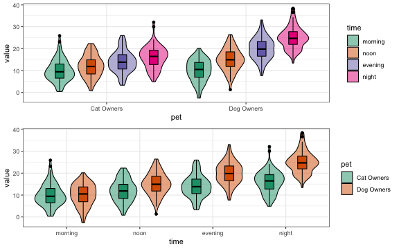
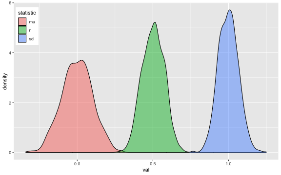
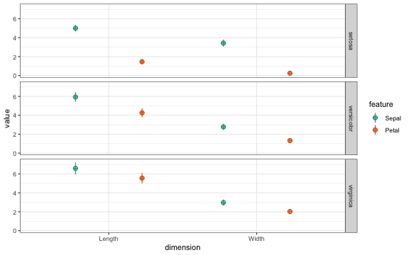

# faux 
<!-- rmarkdown v1 -->
<!-- README.md is generated from README.Rmd. Please edit that file -->

<!-- badges: start -->
[](https://zenodo.org/badge/latestdoi/163506566)


[](https://lifecycle.r-lib.org/articles/stages.html#stable)
[](https://travis-ci.org/debruine/faux)
[](https://codecov.io/github/debruine/faux?branch=master)
[](https://github.com/debruine/faux/actions)
<!-- badges: end -->


It is useful to be able to simulate data with a specified structure. The `faux` package provides some functions to make this process easier. See the [package website](https://debruine.github.io/faux/) for more details.

## Installation

You can install the released version of faux from [CRAN](https://CRAN.R-project.org) with:

``` r
install.packages("faux")
```

And the development version from [GitHub](https://github.com/debruine/faux) with:

``` r
# install.packages("devtools")
devtools::install_github("debruine/faux")
```

## How to use faux

* [sim_design](#sim_design)
* [sim_df](#sim_df)
* [sim_mixed_cc](#sim_mixed_cc)
* [sim_mixed_df](#sim_mixed_df)
* [rnorm_multi](#rnorm_multi)
* [rnorm_pre](#rnorm_pre)
* [additional functions](#add_func)


## sim_design

This function creates a dataset with a specific between- and/or within-subjects design. [see vignette](https://debruine.github.io/faux/articles/sim_design.html)

For example, the following creates a 2w*2b design with 100 observations in each cell. The between-subject factor is `pet` with two levels (`cat` and `dog`). The within-subject factor is `time` with two levels (`day` and `night`). The mean for the `cat_day` cell is 10, the mean for the `cat_night` cell is 20, the mean for the `dog_day` cell is 15, and the mean for the `dog_night` cell is 25. All cells have a SD of 5 and all within-subject cells are correlated <code>r = 0.5</code>. The resulting data has exactly these values (set `empirical = FALSE` to sample from a population with these values). Set `plot = TRUE` to show a plot of means and SDs.


```r
between <- list(pet = c(cat = "Cat Owners", 
                        dog = "Dog Owners"))
within <- list(time = c("morning", "noon", "evening", "night"))
mu <- data.frame(
  cat    = c(10, 12, 14, 16),
  dog    = c(10, 15, 20, 25),
  row.names = within$time
)
df <- sim_design(within, between, 
                 n = 100, mu = mu, sd = 5, r = .5,
                 empirical = TRUE, plot = TRUE)
```


|pet |   n|var     | morning| noon| evening| night| mean| sd|
|:---|---:|:-------|-------:|----:|-------:|-----:|----:|--:|
|cat | 100|morning |     1.0|  0.5|     0.5|   0.5|   10|  5|
|cat | 100|noon    |     0.5|  1.0|     0.5|   0.5|   12|  5|
|cat | 100|evening |     0.5|  0.5|     1.0|   0.5|   14|  5|
|cat | 100|night   |     0.5|  0.5|     0.5|   1.0|   16|  5|
|dog | 100|morning |     1.0|  0.5|     0.5|   0.5|   10|  5|
|dog | 100|noon    |     0.5|  1.0|     0.5|   0.5|   15|  5|
|dog | 100|evening |     0.5|  0.5|     1.0|   0.5|   20|  5|
|dog | 100|night   |     0.5|  0.5|     0.5|   1.0|   25|  5|


Table: Sample `sim_design()` stats

You can plot the data from `sim_design()` and swap the factor visualisations. [see vignette](https://debruine.github.io/faux/articles/plots.html)


```r
p1 <- plot_design(df)
p2 <- plot_design(df, "pet", "time")

cowplot::plot_grid(p1, p2, nrow = 2, align = "v")
```




## sim_df

This function produces a data table with the same distributions and correlations as an existing data table. It only returns numeric columns and simulates all numeric variables from a continuous normal distribution (for now). [see vignette](https://debruine.github.io/faux/articles/sim_df.html)

For example, the following code creates a new sample from the built-in dataset `iris` with 50 observations of each species.


```r
new_iris <- sim_df(iris, 50, between = "Species") 
```


## sim_mixed_cc

This function produces a data table for a basic cross-classified design with random intercepts for subjects and items. 

For example, the following code produces the data for 100 subjects responding to 50 items where the response has an overall mean (`grand_i`) of 10. Subjects vary in their average response with an SD of 1, items vary in their average response with an SD of 2, and the residual error term has an SD of 3.


```r
dat <- sim_mixed_cc(
  sub_n = 100,  # subject sample size
  item_n = 50,  # item sample size
  grand_i = 10, # overall mean of the score
  sub_sd = 1,   # SD of subject random intercepts
  item_sd = 2,  # SD of item random intercepts
  error_sd = 3  # SD of residual error
)
```

You can then see how changing these numbers affects the random effects in an intercept-only mixed effects model.


```r
lme4::lmer(y ~ 1 + (1 | sub_id) + (1 | item_id), data = dat) %>%
  broom.mixed::tidy() %>%
  knitr::kable(digits = 2)
#> Registered S3 method overwritten by 'broom.mixed':
#>   method      from 
#>   tidy.gamlss broom
```


|effect   |group    |term            | estimate| std.error| statistic|
|:--------|:--------|:---------------|--------:|---------:|---------:|
|fixed    |NA       |(Intercept)     |     9.79|      0.28|     34.83|
|ran_pars |sub_id   |sd__(Intercept) |     0.99|        NA|        NA|
|ran_pars |item_id  |sd__(Intercept) |     1.84|        NA|        NA|
|ran_pars |Residual |sd__Observation |     2.95|        NA|        NA|

## sim_mixed_df

This function uses `lme4::lmer()` to get subject, item and error SDs from an existing dataset and simulates a new dataset with the specified number of subjects and items with distributions drawn from the example data.


```r

new_dat <- sim_mixed_df(fr4, 
                        sub_n = 100, 
                        item_n = 50, 
                        dv = "rating", 
                        sub_id = "rater_id", 
                        item_id = "face_id")

```


## rnorm_multi

This function makes multiple normally distributed vectors with specified parameters and relationships. [see vignette](https://debruine.github.io/faux/articles/rnorm_multi.html)

For example, the following creates a sample that has 100 observations of 3 variables, drawn from a population where A has a mean of 0 and SD of 1, while B and C have means of 20 and SDs of 5. A correlates with B and C with r = 0.5, and B and C correlate with r = 0.25.


```r

dat <- rnorm_multi(
  n = 100, 
  mu = c(0, 20, 20),
  sd = c(1, 5, 5),
  r = c(0.5, 0.5, 0.25), 
  varnames = c("A", "B", "C"),
  empirical = FALSE
)
```


|   n|var |    A|    B|    C|  mean|   sd|
|---:|:---|----:|----:|----:|-----:|----:|
| 100|A   | 1.00| 0.53| 0.55|  0.02| 1.08|
| 100|B   | 0.53| 1.00| 0.29| 20.18| 5.15|
| 100|C   | 0.55| 0.29| 1.00| 20.18| 5.25|


Table: Sample `rnorm_multi()` stats


## rnorm_pre

This function creates a vector that has a specified correlation with an existing vector. 


```r
# create a pre-existing vector x
x <- rnorm(100, 0, 1)

# create a vector y with exactly mean=0, sd=1, and r(x,y)=0.5
y <- rnorm_pre(x, mu = 0, sd = 1, r = 0.5, empirical = TRUE)

list(
  mean = mean(y),
  sd = sd(y),
  r = cor(x,y)
) %>% str()
#> List of 3
#>  $ mean: num -6.16e-19
#>  $ sd  : num 1
#>  $ r   : num 0.5
```


If `empirical = FALSE` (the default), this resulting vector is sampled from a population with the specified parameters (but won't have *exactly* those properties).




## Additional functions {#add_func}

### messy

Sometimes you want to mess up a dataset for teaching (thanks for the idea, Emily!). The `messy()` function will replace `prop` proportion of the data in the specified columns with the value of `replace` (defaults to `NA`).


```r
# replace 10% of Species with NA
iris2 <- messy(iris, 0.1, "Species")

# replace 10% of petal.Width adn Sepal.Width with NA
iris3 <- messy(iris, 0.1, "Petal.Width", "Sepal.Width")

# replace 50% of columns 1-2 with NA
iris4 <- messy(iris, 0.5, 1:2)

# replace 50% of Species with "NOPE"
iris5 <- messy(iris, 0.5, "Species", replace = "NOPE")
```

### get_params

If you want to check your simulated stats or just describe an existing dataset, use `get_params()`.


```r
get_params(iris)
```


|   n|var          | Sepal.Length| Sepal.Width| Petal.Length| Petal.Width| mean|   sd|
|---:|:------------|------------:|-----------:|------------:|-----------:|----:|----:|
| 150|Sepal.Length |         1.00|       -0.12|         0.87|        0.82| 5.84| 0.83|
| 150|Sepal.Width  |        -0.12|        1.00|        -0.43|       -0.37| 3.06| 0.44|
| 150|Petal.Length |         0.87|       -0.43|         1.00|        0.96| 3.76| 1.77|
| 150|Petal.Width  |         0.82|       -0.37|         0.96|        1.00| 1.20| 0.76|


You can also group your data and change the digits to round.


```r
get_params(iris, 
           between = "Species", 
           digits = 3)
```


|Species    |  n|var          | Sepal.Length| Sepal.Width| Petal.Length| Petal.Width| mean|   sd|
|:----------|--:|:------------|------------:|-----------:|------------:|-----------:|----:|----:|
|setosa     | 50|Sepal.Length |         1.00|        0.74|         0.27|        0.28| 5.01| 0.35|
|setosa     | 50|Sepal.Width  |         0.74|        1.00|         0.18|        0.23| 3.43| 0.38|
|setosa     | 50|Petal.Length |         0.27|        0.18|         1.00|        0.33| 1.46| 0.17|
|setosa     | 50|Petal.Width  |         0.28|        0.23|         0.33|        1.00| 0.25| 0.11|
|versicolor | 50|Sepal.Length |         1.00|        0.53|         0.75|        0.55| 5.94| 0.52|
|versicolor | 50|Sepal.Width  |         0.53|        1.00|         0.56|        0.66| 2.77| 0.31|
|versicolor | 50|Petal.Length |         0.75|        0.56|         1.00|        0.79| 4.26| 0.47|
|versicolor | 50|Petal.Width  |         0.55|        0.66|         0.79|        1.00| 1.33| 0.20|
|virginica  | 50|Sepal.Length |         1.00|        0.46|         0.86|        0.28| 6.59| 0.64|
|virginica  | 50|Sepal.Width  |         0.46|        1.00|         0.40|        0.54| 2.97| 0.32|
|virginica  | 50|Petal.Length |         0.86|        0.40|         1.00|        0.32| 5.55| 0.55|
|virginica  | 50|Petal.Width  |         0.28|        0.54|         0.32|        1.00| 2.03| 0.27|


### make_id

It is useful for IDs for random effects (e.g., subjects or stimuli) to be character strings (so you don't accidentally include them as fixed effects) with the same length s(o you can sort them in order like S01, S02,..., S10 rather than S1, S10, S2, ...) This function returns a list of IDs that have the same string length and a specified prefix.


```r
make_id(n = 10, prefix = "ITEM_")
#>  [1] "ITEM_01" "ITEM_02" "ITEM_03" "ITEM_04" "ITEM_05" "ITEM_06" "ITEM_07"
#>  [8] "ITEM_08" "ITEM_09" "ITEM_10"
```

You can also manually set the number of digits and set `n` to a range of integers.


```r
make_id(n = 10:20, digits = 3)
#>  [1] "S010" "S011" "S012" "S013" "S014" "S015" "S016" "S017" "S018" "S019"
#> [11] "S020"
```


### long2wide

Convert a data table made with faux from long to wide. 


```r
between <- list("pet" = c("cat", "dog"))
within <- list("time" = c("day", "night"))
df_long <- sim_design(within, between, long = TRUE, plot = FALSE)

df_wide <- long2wide(df_long)
```


|id   |pet |        day|      night|
|:----|:---|----------:|----------:|
|S001 |cat |  0.5230799|  0.5415126|
|S002 |cat | -1.2129722| -0.6874280|
|S003 |cat | -0.5516822| -0.7844739|
|S004 |cat | -0.6098251| -0.6234040|
|S005 |cat |  0.2853363|  2.3027620|
|S006 |cat | -0.2490935| -0.6530662|

If you have a data table not made by faux, you need to specify the within-subject columns, the between-subject columns, the DV column, and the ID column.


```r
# make a long data table
df_long <- expand.grid(
  sub_id = 1:10,
  A = c("A1", "A2"),
  B = c("B1", "B2")
)
df_long$C <- rep(c("C1", "C2"), 20)
df_long$score <- rnorm(40)

# convert it to wide
df_wide <- long2wide(df_long, within = c("A", "B"), 
                     between = "C", dv = "score", id = "sub_id")
```


| sub_id|C  |      A1_B1|      A2_B1|      A1_B2|      A2_B2|
|------:|:--|----------:|----------:|----------:|----------:|
|      1|C1 | -0.3782026|  0.0048040| -0.5674500|  0.6154273|
|      2|C2 |  0.5338898| -1.6407051|  1.7815958| -2.1325543|
|      3|C1 |  1.2792787|  1.4960844|  0.6207239|  1.7913821|
|      4|C2 |  0.1885384| -0.0884940| -0.7397000|  0.0295121|
|      5|C1 | -0.3090509| -0.3942107|  0.9916406| -0.2951152|
|      6|C2 |  1.4168226|  0.8341336|  0.0634940| -1.1571559|


### wide2long

You can convert a data table made by faux from wide to long easily.


```r
between <- list("pet" = c("cat", "dog"))
within <- list("time" = c("day", "night"))
df_wide <- sim_design(within, between, long = FALSE, plot = FALSE)
df_long <- wide2long(df_wide)
```


|       |id   |pet |time |          y|
|:------|:----|:---|:----|----------:|
|S001.1 |S001 |cat |day  | -0.9012830|
|S002.1 |S002 |cat |day  | -0.3205931|
|S003.1 |S003 |cat |day  | -0.7733501|
|S004.1 |S004 |cat |day  | -1.1861210|
|S005.1 |S005 |cat |day  | -1.0848848|
|S006.1 |S006 |cat |day  | -0.4888620|


If you have a data table not made by faux, you need to specify the within-subject factors and columns, and specify the names of the ID and DV columns to create. 

If column names are combinations of factor levels (e.g., A1_B1, A1_B2, A2_B1, A2_B2), then you can specify the regex pattern to separate them with the argument `sep` (which defaults to `_`).


```r
long_iris <- wide2long(
    iris,
    within_factors = c("feature", "dimension"),
    within_cols = 1:4,
    dv = "value",
    id = "flower_id",
    sep = "\\."
  )
```


|       |flower_id |Species |feature |dimension | value|
|:------|:---------|:-------|:-------|:---------|-----:|
|S001.1 |S001      |setosa  |Sepal   |Length    |   5.1|
|S002.1 |S002      |setosa  |Sepal   |Length    |   4.9|
|S003.1 |S003      |setosa  |Sepal   |Length    |   4.7|
|S004.1 |S004      |setosa  |Sepal   |Length    |   4.6|
|S005.1 |S005      |setosa  |Sepal   |Length    |   5.0|
|S006.1 |S006      |setosa  |Sepal   |Length    |   5.4|


### get_design_long

If you have a data table in long format, you can recover the design from it by specifying the dv and id columns (assuming all other columns are within- or between-subject factors).


```r
design <- get_design_long(long_iris, dv = "value", id = "flower_id")
```



### json_design

Then you can use `json_design()` to save the design to a file or view it in JSON format (condensed or pretty).


```r
json_design(design)
```

<pre>
{"within":{"feature":{"Sepal":"Sepal","Petal":"Petal"},"dimension":{"Length":"Length","Width":"Width"}},"between":{"Species":{"setosa":"setosa","versicolor":"versicolor","virginica":"virginica"}},"dv":{"value":"value"},"id":{"flower_id":"flower_id"},"n":{"setosa":50,"versicolor":50,"virginica":50},"mu":{"setosa":{"Sepal_Length":5.006,"Sepal_Width":3.428,"Petal_Length":1.462,"Petal_Width":0.246},"versicolor":{"Sepal_Length":5.936,"Sepal_Width":2.77,"Petal_Length":4.26,"Petal_Width":1.326},"virginica":{"Sepal_Length":6.588,"Sepal_Width":2.974,"Petal_Length":5.552,"Petal_Width":2.026}},"sd":{"setosa":{"Sepal_Length":0.35248969,"Sepal_Width":0.37906437,"Petal_Length":0.173664,"Petal_Width":0.10538559},"versicolor":{"Sepal_Length":0.51617115,"Sepal_Width":0.31379832,"Petal_Length":0.46991098,"Petal_Width":0.19775268},"virginica":{"Sepal_Length":0.63587959,"Sepal_Width":0.32249664,"Petal_Length":0.5518947,"Petal_Width":0.27465006}},"r":{"setosa":[[1,0.74254669,0.26717576,0.27809835],[0.74254669,1,0.17769997,0.23275201],[0.26717576,0.17769997,1,0.33163004],[0.27809835,0.23275201,0.33163004,1]],"versicolor":[[1,0.52591072,0.75404896,0.54646107],[0.52591072,1,0.56052209,0.66399872],[0.75404896,0.56052209,1,0.78666809],[0.54646107,0.66399872,0.78666809,1]],"virginica":[[1,0.45722782,0.86422473,0.28110771],[0.45722782,1,0.40104458,0.53772803],[0.86422473,0.40104458,1,0.32210822],[0.28110771,0.53772803,0.32210822,1]]},"sep":"_"}
</pre>


```r
json_design(design, pretty = TRUE)
```

<pre>
{
  "within": {
    "feature": {
      "Sepal": "Sepal",
      "Petal": "Petal"
    },
    "dimension": {
      "Length": "Length",
      "Width": "Width"
    }
  },
  "between": {
    "Species": {
      "setosa": "setosa",
      "versicolor": "versicolor",
      "virginica": "virginica"
    }
  },
  "dv": {
    "value": "value"
  },
  "id": {
    "flower_id": "flower_id"
  },
  "n": {
    "setosa": 50,
    "versicolor": 50,
    "virginica": 50
  },
  "mu": {
    "setosa": {
      "Sepal_Length": 5.006,
      "Sepal_Width": 3.428,
      "Petal_Length": 1.462,
      "Petal_Width": 0.246
    },
    "versicolor": {
      "Sepal_Length": 5.936,
      "Sepal_Width": 2.77,
      "Petal_Length": 4.26,
      "Petal_Width": 1.326
    },
    "virginica": {
      "Sepal_Length": 6.588,
      "Sepal_Width": 2.974,
      "Petal_Length": 5.552,
      "Petal_Width": 2.026
    }
  },
  "sd": {
    "setosa": {
      "Sepal_Length": 0.35248969,
      "Sepal_Width": 0.37906437,
      "Petal_Length": 0.173664,
      "Petal_Width": 0.10538559
    },
    "versicolor": {
      "Sepal_Length": 0.51617115,
      "Sepal_Width": 0.31379832,
      "Petal_Length": 0.46991098,
      "Petal_Width": 0.19775268
    },
    "virginica": {
      "Sepal_Length": 0.63587959,
      "Sepal_Width": 0.32249664,
      "Petal_Length": 0.5518947,
      "Petal_Width": 0.27465006
    }
  },
  "r": {
    "setosa": [
      [1, 0.74254669, 0.26717576, 0.27809835],
      [0.74254669, 1, 0.17769997, 0.23275201],
      [0.26717576, 0.17769997, 1, 0.33163004],
      [0.27809835, 0.23275201, 0.33163004, 1]
    ],
    "versicolor": [
      [1, 0.52591072, 0.75404896, 0.54646107],
      [0.52591072, 1, 0.56052209, 0.66399872],
      [0.75404896, 0.56052209, 1, 0.78666809],
      [0.54646107, 0.66399872, 0.78666809, 1]
    ],
    "virginica": [
      [1, 0.45722782, 0.86422473, 0.28110771],
      [0.45722782, 1, 0.40104458, 0.53772803],
      [0.86422473, 0.40104458, 1, 0.32210822],
      [0.28110771, 0.53772803, 0.32210822, 1]
    ]
  },
  "sep": "_"
}
</pre>

### pos_def_limits

Not all correlation matrices are possible. For example, if variables A and B are correlated with r = 1.0, then the correlation between A and C can only be exactly equal to the correlation between B and C.

The function `pos_def_limits()` lets you know what the possible range of values is for the missing value in a correlation matrix with one missing value. The correlation values are entered just from the top right triangle of the matrix, with a single `NA` for the missing value.


```r
lims <- pos_def_limits(.8, .2, NA)
```


|     x|
|-----:|
| -0.42|

|    x|
|----:|
| 0.74|


For example, if r~AB~ = 0.8 and r~AC~ = 0.2, then -0.42 <= r~BC~ <= 0.74.

If you enter a correlation matrix that contains impossible combinations, your limits will be `NA`.


```r
lims <- pos_def_limits(.8, .2,  0,
                          -.5, NA,
                               .2)
```


|x  |
|:--|
|NA |

|x  |
|:--|
|NA |


### is_pos_def

If you have a full matrix and want to know if it is positive definite, you can use the following code:


```r
c(.2, .3, .4, .2,
      .3, -.1, .2,
           .4, .5,
               .3) %>%
  cormat_from_triangle() %>%
  is_pos_def()
#> [1] TRUE
```


```r
matrix(c(1, .3, -.9, .2,
        .3,  1,  .4, .5,
       -.9, .4,   1, .3,
        .2, .5,  .3,  1), 4) %>%
  is_pos_def()
#> [1] FALSE
```


Please note that the [34m'faux'[39m project is released with a [Contributor Code of Conduct](https://github.com/debruine/faux/blob/master/CODE_OF_CONDUCT.md). By contributing to this project, you agree to abide by its terms.

