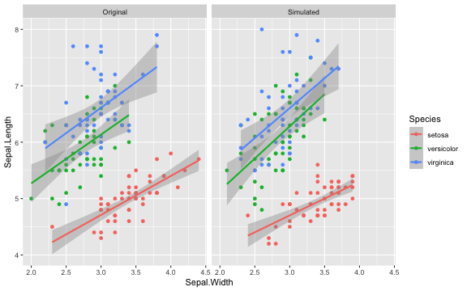

# faux 
<!-- rmarkdown v1 -->

<!-- badges: start -->
[](https://zenodo.org/badge/latestdoi/163506566)


[](https://lifecycle.r-lib.org/articles/stages.html#stable)
[](https://travis-ci.org/debruine/faux)
[](https://codecov.io/github/debruine/faux?branch=master)
[](https://github.com/debruine/faux/actions)
<!-- badges: end -->


It is useful to be able to simulate data with a specified structure. The `faux` package provides some functions to make this process easier. See the [vignettes](articles/) for more details.

## Installation

You can install the released version of faux (1.0.0) from [CRAN](https://CRAN.R-project.org) with:

``` r
install.packages("faux")
```

And the development version (1.0.0.9002) from [GitHub](https://github.com/debruine/faux) with:

``` r
# install.packages("devtools")
devtools::install_github("debruine/faux")
```

See the [development version manual](https://debruine.github.io/faux/dev/).

## Quick overview

### Simulate data for a factorial design


```r
between <- list(pet = c(cat = "Cat Owners", 
                        dog = "Dog Owners"))
within <- list(time = c("morning", 
                        "noon", 
                        "evening", 
                        "night"))
mu <- data.frame(
  cat    = c(10, 12, 14, 16),
  dog    = c(10, 15, 20, 25),
  row.names = within$time
)
df <- sim_design(within, between, 
                 n = 100, mu = mu, 
                 sd = 5, r = .5)
```


```r
p1 <- plot_design(df)
p2 <- plot_design(df, "pet", "time")

cowplot::plot_grid(p1, p2, nrow = 2, align = "v")
```


### Simulate new data from an existing data table


```r
new_iris <- sim_df(iris, 50, between = "Species") 
```



## Other simulation packages

I started this project as a collection of functions I was writing to help with my own work. It's one of many, many simulation packages in R; here are some others. I haven't used most of them, so I can't vouch for them, but if faux doesn't meet your needs, one of these might.

* [simstudy](https://www.rdatagen.net/page/simstudy/): Simulation of Study Data
* [simr](https://github.com/pitakakariki/simr): Power Analysis of Generalised Linear Mixed Models by Simulation
* [simulator](http://github.com/jacobbien/simulator): streamlines the process of performing simulations by creating a common infrastructure that can be easily used and reused across projects
* [lsasim](https://github.com/tmatta/lsasim): Simulate large scale assessment data 
* [simmer](https://r-simmer.org/): Trajectory-based Discrete-Event Simulation (DES
* [parSim](https://cran.r-project.org/web/packages/parSim/): Parallel Simulation Studies

